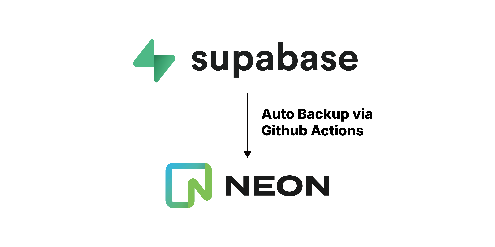

# Database Auto Backup From Supabase to Neon


![Supabase](https://img.shields.io/badge/Neon-73e1a2?style=flat-square&logo=data:image/svg+xml;base64,PHN2ZyB3aWR0aD0iNTgiIGhlaWdodD0iNTciIHZpZXdCb3g9IjAgMCA1OCA1NyIgZmlsbD0ibm9uZSIgeG1sbnM9Imh0dHA6Ly93d3cudzMub3JnLzIwMDAvc3ZnIj4KPHBhdGggZmlsbC1ydWxlPSJldmVub2RkIiBjbGlwLXJ1bGU9ImV2ZW5vZGQiIGQ9Ik0wIDkuODI3NTlDMCA0LjM5OTk2IDQuNDc3MDUgMCA5Ljk5OTc2IDBINDcuOTk4OUM1My41MjE2IDAgNTcuOTk4NiA0LjM5OTk2IDU3Ljk5ODYgOS44Mjc1OVY0MS41ODkzQzU3Ljk5ODYgNDcuMjA0NSA1MC43Njg0IDQ5LjY0MTQgNDcuMjYxOCA0NS4yMDgyTDM2LjI5OTEgMzEuMzQ4OFY0OC4xNTUyQzM2LjI5OTEgNTMuMDQgMzIuMjY5OCA1NyAyNy4yOTkzIDU3SDkuOTk5NzZDNC40NzcwNSA1NyAwIDUyLjYgMCA0Ny4xNzI0VjkuODI3NTlaTTkuOTk5NzYgNy44NjIwN0M4Ljg5NTIyIDcuODYyMDcgNy45OTk4MSA4Ljc0MjA2IDcuOTk5ODEgOS44Mjc1OVY0Ny4xNzI0QzcuOTk5ODEgNDguMjU3OSA4Ljg5NTIyIDQ5LjEzNzkgOS45OTk3NiA0OS4xMzc5SDI3LjU5OTNDMjguMTUxNiA0OS4xMzc5IDI4LjI5OTMgNDguNjk3OSAyOC4yOTkzIDQ4LjE1NTJWMjUuNjE3OEMyOC4yOTkzIDIwLjAwMjcgMzUuNTI5NSAxNy41NjU2IDM5LjAzNjEgMjEuOTk4OUw0OS45OTg4IDM1Ljg1ODNWOS44Mjc1OUM0OS45OTg4IDguNzQyMDYgNTAuMTAzNCA3Ljg2MjA3IDQ4Ljk5ODggNy44NjIwN0g5Ljk5OTc2WiIgZmlsbD0iIzBDMEQwRCIvPgo8cGF0aCBkPSJNNDguMDAwMyAwQzUzLjUyMyAwIDU4IDQuMzk5OTYgNTggOS44Mjc1OVY0MS41ODkzQzU4IDQ3LjIwNDUgNTAuNzY5OSA0OS42NDE0IDQ3LjI2MzMgNDUuMjA4MkwzNi4zMDA2IDMxLjM0ODhWNDguMTU1MkMzNi4zMDA2IDUzLjA0IDMyLjI3MTIgNTcgMjcuMzAwOCA1N0MyNy44NTMxIDU3IDI4LjMwMDggNTYuNTYgMjguMzAwOCA1Ni4wMTcyVjI1LjYxNzhDMjguMzAwOCAyMC4wMDI3IDM1LjUzMDkgMTcuNTY1NiAzOS4wMzc1IDIxLjk5ODlMNTAuMDAwMiAzNS44NTgzVjEuOTY1NTJDNTAuMDAwMiAwLjg3OTk5MiA0OS4xMDQ4IDAgNDguMDAwMyAwWiIgZmlsbD0iIzBDMEQwRCIvPgo8L3N2Zz4K&logoColor=white)



Automated PostgreSQL database backup solution using GitHub Actions. 

This template repository backs up your database from [Supabase](https://supabase.com/) to [Neon](https://neon.com/) on a scheduled basis.


## Features

- Automated scheduled backup (default: daily at 00:00 UTC, fully customizable)
- Full database export from Supabase using PostgreSQL 17 client
- Restore to Neon with complete overwrite
- Configurable retention of backup snapshots (default: 7 most recent)
- Error notifications via GitHub Actions
- Manual trigger support
- Automatic SSL certificate handling (custom certificate for Supabase, system certificate for Neon)

## Prerequisites

- GitHub account with Actions enabled
- Supabase PostgreSQL database (source)
- Neon PostgreSQL database (destination)
- Database credentials with appropriate permissions

## Quick Start

### 1. Use This Template

Click the "Use this template" button at the top of this repository to create your own copy.

### 2. Obtain Database Credentials

#### Supabase Configuration

1. Navigate to your Supabase project: Settings → Database
2. Locate the Connection String in URI format
3. Copy the complete connection string:
   ```
   postgresql://postgres:[YOUR-PASSWORD]@[HOST]:[PORT]/postgres?sslmode=require
   ```
4. Download SSL certificate:
   - Find the "SSL enforcement" section
   - Download the CA certificate (typically named `ca-certificate.crt`)
   - Convert to base64 format:
     ```bash
     cat ca-certificate.crt | base64 | tr -d '\n'
     ```
   - Copy the base64 output string

#### Neon Configuration

1. Navigate to your Neon project's Connection Details
2. Copy the Pooled Connection String
3. Ensure the format matches:
   ```
   postgresql://[user]:[password]@[host]/[database]?sslmode=require
   ```
4. Remove the `channel_binding` parameter if present

### 3. Configure GitHub Secrets

1. Go to your repository: Settings → Secrets and variables → Actions
2. Click "New repository secret" and add the following secrets:

   | Name | Value | Required |
   |------|-------|----------|
   | `SUPABASE_DB_URL` | Your Supabase connection string | Yes |
   | `SUPABASE_SSL_CERT_BASE64` | Your Supabase SSL certificate (base64 encoded) | Yes |
   | `NEON_DB_URL` | Your Neon connection string (without `channel_binding` parameter) | Yes |
   | `BACKUP_RETENTION_COUNT` | Number of backup snapshots to keep (e.g., `7`) | No (defaults to 7) |

### 4. Enable GitHub Actions

1. Navigate to the Actions tab in your repository
2. If prompted, click "I understand my workflows, go ahead and enable them"

## Usage

### Automatic Execution

The GitHub Action runs automatically daily at 00:00 UTC. Each backup execution takes approximately 5 to 10 minutes.

### Manual Execution

1. Go to the Actions tab
2. Select "Auto Database Backup" workflow
3. Click "Run workflow"
4. Select the branch and confirm

### Customize Backup Schedule

To change the backup frequency, edit [.github/workflows/auto-backup.yml](.github/workflows/auto-backup.yml) and modify the cron expression:

```yaml
on:
  schedule:
    - cron: '0 0 * * *'  # Change this line
```

Common cron patterns:
- `0 0 * * *` - Daily at midnight UTC (default)
- `0 */6 * * *` - Every 6 hours
- `0 0 */3 * *` - Every 3 days
- `0 0 * * 1` - Weekly on Monday

Tip: Use [crontab.guru](https://crontab.guru/) to help create cron expressions.

### Customize Backup Retention

To change how many backup snapshots to keep:

1. Go to repository Settings → Secrets and variables → Actions
2. Add or update the `BACKUP_RETENTION_COUNT` secret
3. Set the value to your desired number (e.g., `14` for 14 most recent backups)
4. Default is `7` if not set

## Backup Files

- Location: `backups/` directory
- Naming convention: `backup_YYYY-MM-DD.sql`
- Retention: Configurable number of most recent snapshots preserved (default: 7)
- Older backups are automatically deleted after each successful backup

## Monitoring

### Check Backup Status

1. Navigate to the Actions tab
2. View execution history of "Auto Database Backup" workflow
3. Green checkmark indicates success, red cross indicates failure

### Failure Notifications

GitHub sends email notifications to repository owners when workflows fail by default.

To customize notification settings:
1. Go to your GitHub profile Settings (not repository settings)
2. Select Notifications
3. Configure preferences in the Actions section

## Important Notes

### Security Considerations

1. **Keep Repository Private**: Backup files may contain sensitive data
2. **Use Secrets for Credentials**: Never commit database connection strings to code
3. **Neon Database Overwrite**: Each backup completely overwrites the Neon database. Ensure Neon is used exclusively for backups
4. **Repository Size**: Monitor repository size as backups accumulate (GitHub recommends repositories under 1GB)

## Contributing

Contributions are welcome. Please feel free to submit issues or pull requests.

## License

MIT License 